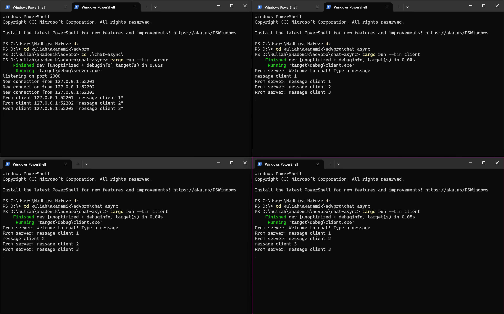
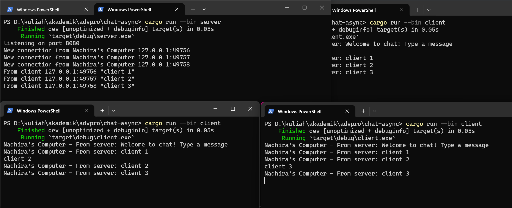

# Tutorial 10
**2.1. Original code of broadcast chat.** 

Tiap client akan membuat koneksi baru dengan port yang berbeda namun masih terhubung dalam satu server dan hal ini membuat setiap ada pesan yang masuk dari salah satu client akan terhubung ke dalam port yang lain dan menampilkan pesan dari client lain.  

**2.2. Modifying the websocket port**  
Pada `server.rs`   
```rust
async fn main() -> Result<(), Box<dyn Error + Send + Sync>> {
    ...

    let listener = TcpListener::bind("127.0.0.1:8080").await?;
    println!("listening on port 8080");

    ...
}
```
Pada `client.rs`
```rust
async fn main() -> Result<(), tokio_websockets::Error> {
    let (mut ws_stream, _) =
        ClientBuilder::from_uri(Uri::from_static("ws://127.0.0.1:8080"))
            .connect()
            .await?;
    ...
}
```  
Karena pada client side menggunakan protokol `tokio_websockets`, server dan client berjalan dengan normal walaupun menggunakan port yang berbeda.   

**2.3. Small changes. Add some information to client**  
  
Perubahan ini dilakukan agar server dapat menampilkan informasi tambahan.